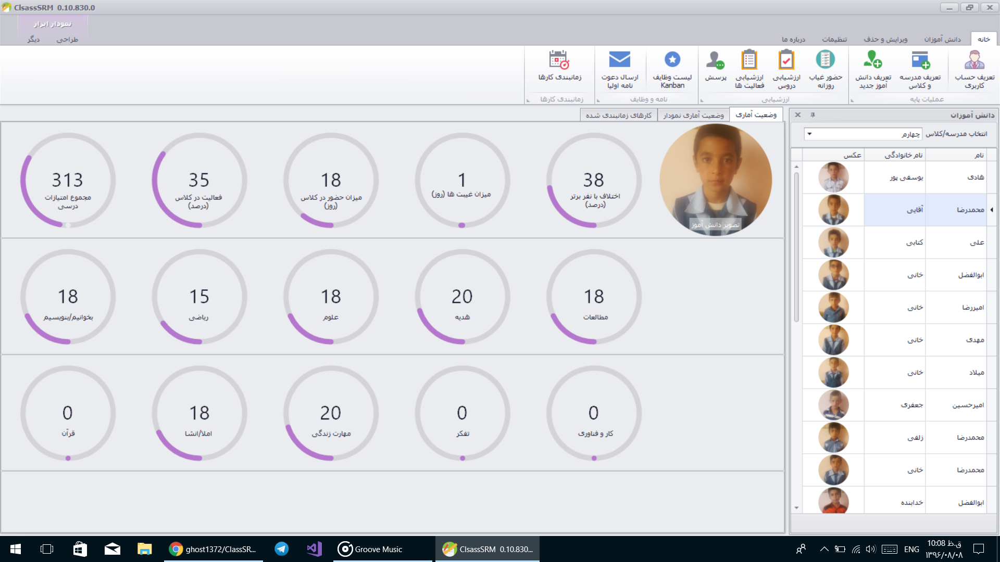
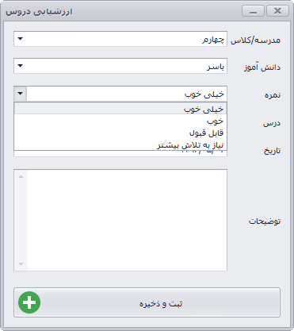
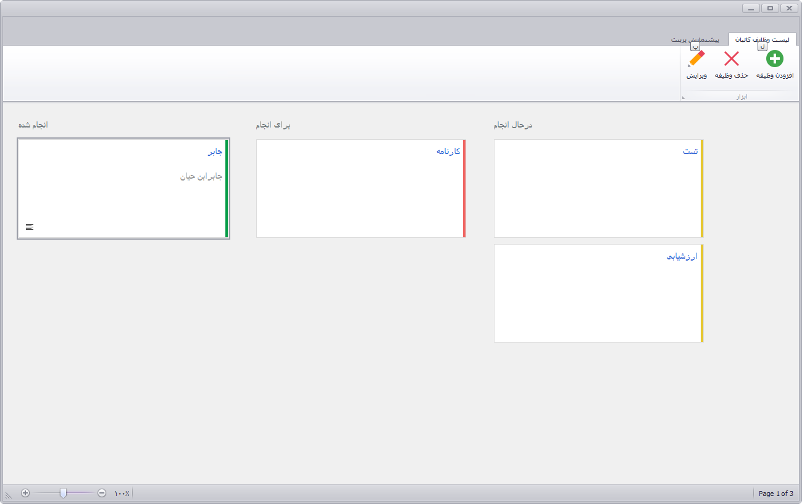
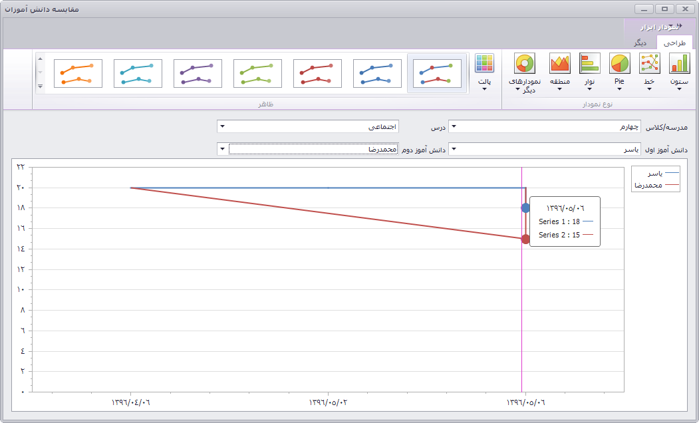
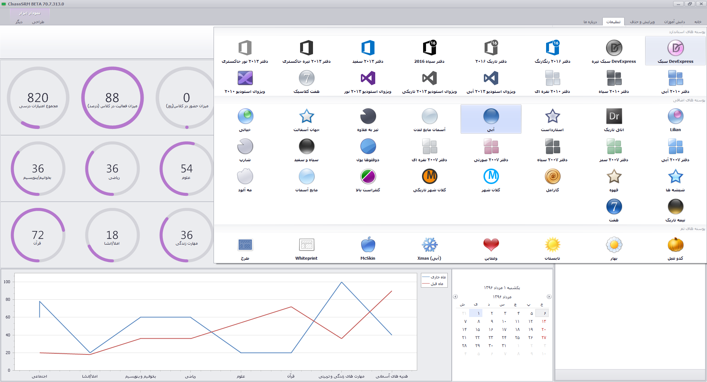
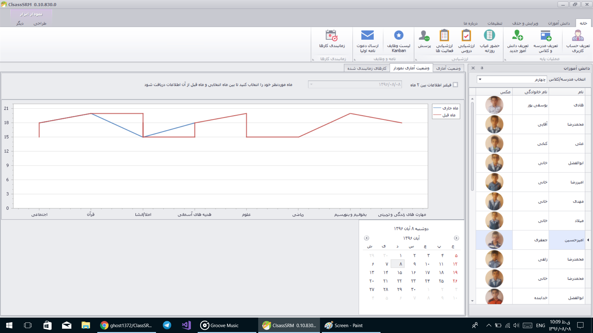
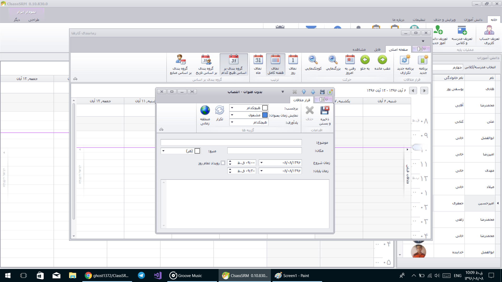

 | 

# ClassSRM
 

این نرم افزار که به فارسی مدیریت روابط کلاس و دانش آموز و یا مدیریت کلاس و دانش آموز خوانده می شود، یک نرم افزار مدیریت مدرسه هوشمند قدرتمند و منسجم جهت هوشمندسازی کامل کلاس می باشد که تقریبا تمامی جنبه های مربوط به پیشرفت و ردیابی دانش آموز  را به صورت یکجا گرد آورده و به بهترین و ساده ترین شکل ممکن در اختیار معلمان عزیز مدارس قرار داده است. معلمان عزیز توسط این نرم افزار کاملا رایگان می توانند اطلاعات دانش آموزان خود را ثبت نموده تا بتوانند وضعیت پیشرفت و پسرفت آنها را بصورت آنی و لحظه ای مشاهده نموده، وضعیت درسی هر دانش آموز را نسبت به خود (باتوجه به ماه قبل) ارزیابی کرده تا بتوانند برای آنها برنامه ریزی مناسب را انجام داد.

# 
 تصاویر

## 
ویژگی ها

 قابلیت ایجاد سال تحصیلی و مدرسه های متعدد
 قابلیت ایجاد دانش آموزان برای هرکلاس با مشخصات + عکس
 دارای امنیت ورود به نرم افزار
 قابلیت حضور غیاب روزانه کلاس
 ارزشیابی دروس بصورت توصیفی و عددی
 ارزشیابی فعالیت های کلاسی (انجام تکالیف،مرتب، حضور به موقع در کلاس و…)
 سیستم هوشمند تشخیص افرادی که پرسش نشده اند
 سیستم پیشرفت تحصیلی هوشمند و پیشرفته با قابلیت مقایسه دانش آموزان در دروس مختلف، امتیازات کلی، و… بصورت نمودار های مختلف
 دارای تنظیمات پیشرفته فونت و ارزشیابی
 سیستم پیشرفته مقایسه دانش آموز با خود
 دارای سیستم پیشرفته لیست وظایف کانبان KANBAN
 قابلیت تشخیص افرادی که نیاز به دریافت جایزه برای تشویق و پیشرفت دارند
 قابلیت تعیین شاگرد های کلاس بصورت ماهانه و سالانه
 قابلیت ویرایش و حذف اطلاعات
 قابلیت پرینت و خروجی به فرمت های مشهور همچون PDF و Excel و…
 بسیار سریع و قدرتمند
 دارای پوسته های متنوع و زیبا
 دارای سیستم بروزرسانی نرم افزار
 تقویم شمسی زیبا و کامل همراه با روزهای تعطیل رسمی
 چاپ نامه برای اولیا دانش آموز
 و…

## 
دانلود

ریلیزها را از اینجا دریافت کنید

 [via the releases tab](https://github.com/ghost1372/ClassSRM/releases). 

## 
نکات

 

 برنامه از دیتابیس Sql Server 2014 استفاده می کند،همچنین قابلیت اتصال به Sql Server 2014 به بالا را دارد که اگر قصد شما چنین بود کافیست دیتابیس را در Sql اتچ نمایید تا برنامه بصورت خودکار با دیتابیس ارتباط برقرار کند.
  
 اگر قصد استفاده از نسخه سبک شده Sql یعنی Sql Express را داشتید کافیست کانکشن استرینگ برنامه را از . (نقطه) به SqlExpress\. تغییر دهید. و دیتابیس را در اکسپرس اتچ نمایید یا اسکریپت دیتابیس را اجرا نمایید.
 

